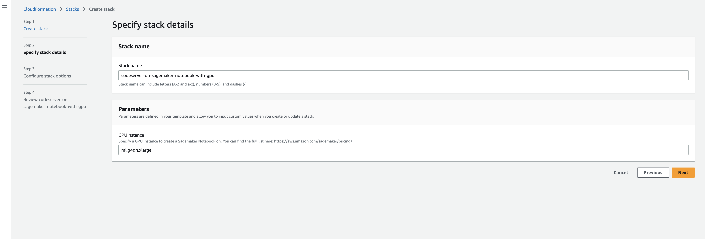
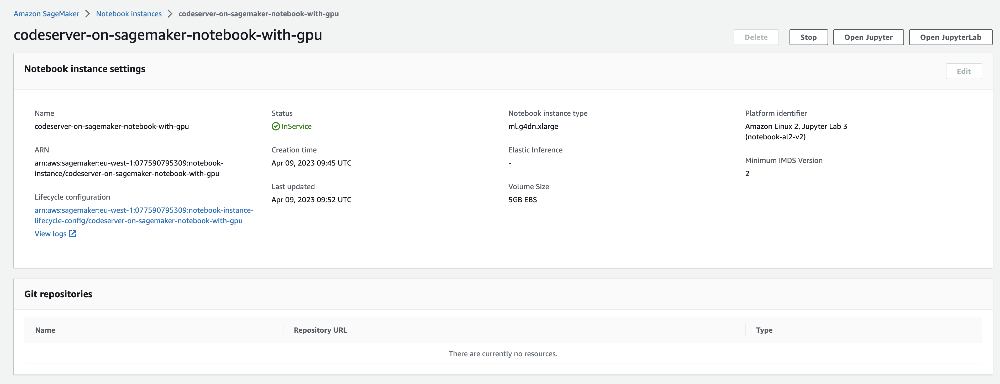
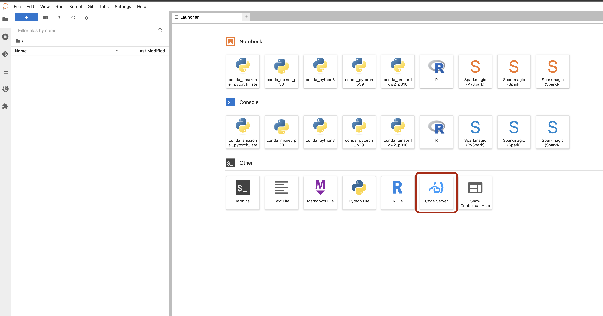
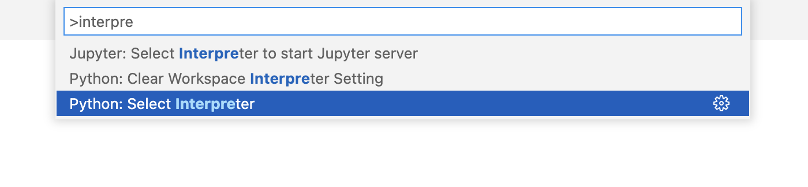
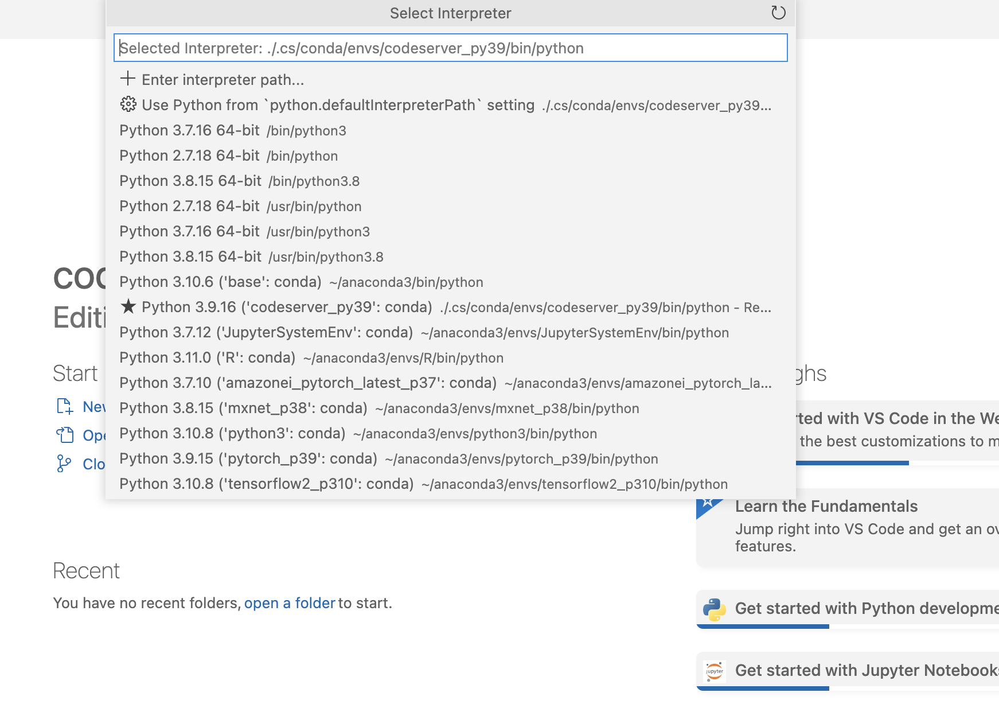

# Codeserver on Sagemaker Notebook with GPU

Repo with a cloudformation template that creates a sagemaker notebook on a GPU instance with code-server pre-installed.

## 1. Click the button to launch the cloudformation stack and follow the steps.

## 2. Specify the instance type.

- ml.p3.2xlarge
- ml.p3.8xlarge
- ml.p3.16xlarge
- ml.p3dn.24xlarge
- ml.g4dn.xlarge >> Fast launch
- ml.g4dn.2xlarge
- ml.g4dn.4xlarge
- ml.g4dn.8xlarge
- ml.g4dn.12xlarge
- ml.g4dn.16xlarge
- ml.g5.xlarge
- ml.g5.2xlarge
- ml.g5.4xlarge
- ml.g5.8xlarge
- ml.g5.12xlarge
- ml.g5.24xlarge
- ml.g5.48xlarge

More info on the GPU instances [here](https://docs.aws.amazon.com/dlami/latest/devguide/gpu.html?utm_source=pocket_reader)

## 3. Open as Jupyter / JupyterLab

## 4. Open code-server on Sagemaker.

## 5. Specify the Python Interpreter

- Go to Command Palette (CMD + Shift + P) 
- Search for "Python Interpreter"

- Select the interpreter from the available Kernels

- Happy coding!